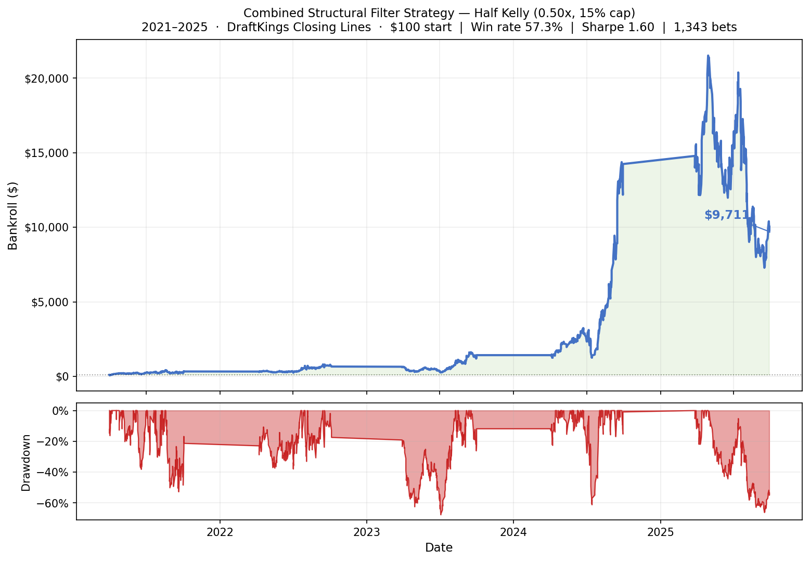
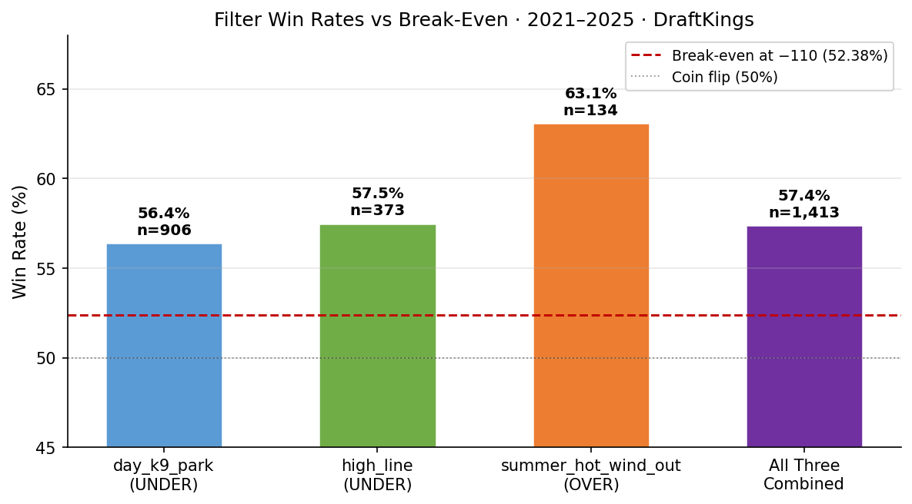
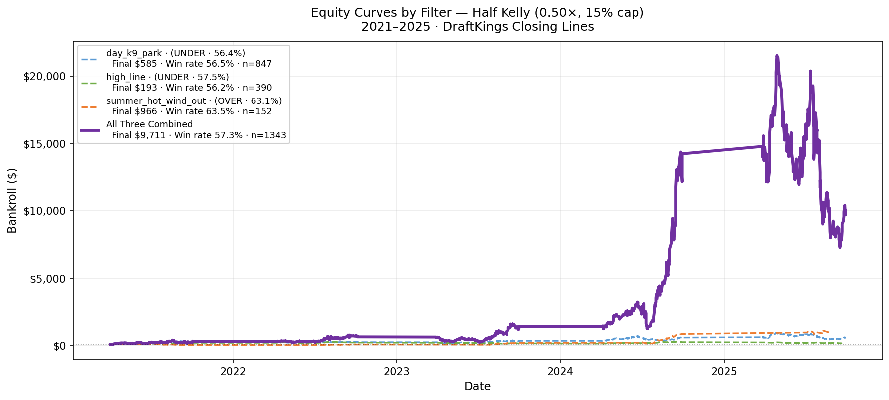

# MLB Total Runs Prediction & Betting System

A systematic strategy for identifying and betting structural edges in MLB totals
markets. Three independent pre-game filters — each with a clear physical
mechanism — were validated over five full seasons (2021–2025) against
DraftKings closing lines. The system executes on Kalshi, a CFTC-regulated
prediction market.

---

## Data Foundation

The filters and model were developed on a purpose-built database covering
**12 MLB seasons (2015–2026)**. Every data source is scraped, cleaned, and
stored locally — nothing is sampled or estimated.

| Dataset | Rows | Source | Used for |
|---|---|---|---|
| Game results | 25,749 | MLB Stats API + pybaseball | Targets, rolling team stats |
| Pitcher game logs | 220,532 | pybaseball | SP ERA, FIP, K/9, BB/9, rest days, last-N form |
| Team batting logs | 51,504 | pybaseball | Rolling OPS, K%, runs scored per game |
| Sportsbook odds | 59,339 | sbrscrape (5 books) | Closing lines — DK, FanDuel, Caesars, Bet365, BetMGM |
| Weather observations | 12,702 | Open-Meteo | Temperature, wind speed, wind direction at first pitch |
| Elo ratings | 51,386 | Computed daily | Team strength signal — zero-sum, updated after every game |
| Kalshi market snapshots | 11,811 | Kalshi REST API | Live pricing for live execution |
| Pitcher Statcast | 3,938 | pybaseball / Baseball Savant | xERA, estimated wOBA |

**The pitcher game log is the most important dataset.** With 220,532 rows
spanning 12 seasons, it provides enough history to compute stable rolling ERA,
K/9, and form metrics for every starting pitcher — even ones with partial seasons
or mid-year call-ups. This depth is what makes the day_k9_park filter reliable:
a combined K/9 threshold of 14.0+ is only trustworthy when the denominator is
large enough to distinguish signal from variance.

**Odds coverage across five sportsbooks (2021–2026)** lets the system use each
book's closing line as an independent signal rather than relying on any single
market. DraftKings is used as the backtest benchmark because it has the deepest
US retail liquidity and its lines best represent the prices a bettor can actually
obtain.

**Weather data is fetched at the game-level**, not the city-level — each entry
is tied to a specific game with the stadium's exact coordinates and outfield
orientation. Wind direction is encoded relative to the stadium's home-plate-to-CF
axis, so "blowing out" means *toward the outfield* for that specific park, not
just a compass bearing.

---

## The Edge: Three Structural Filters

Most MLB betting research focuses on predicting game outcomes. This system takes
a different approach: instead of trying to predict *what will happen*, it
identifies specific pre-game conditions where **the posted line is systematically
mispriced**. No model is needed to trigger a bet — only observable conditions
before first pitch.

---

### Filter 1 — Day Game at Pitcher-Friendly Park with Elite Starters (UNDER)

**Bet:** UNDER, at DraftKings closing price.

**Trigger conditions (all must be true):**
- Game starts before 6 PM local time (day game)
- Venue is one of: San Francisco, Cleveland, Texas, Cincinnati, Chicago (White Sox),
  San Diego, Seattle, or Detroit — parks with structural run suppression built into
  their dimensions or climate
- Combined starter K/9 ≥ 14.0 (both starters are elite swing-and-miss pitchers)
- Per-starter ERA over last 3 starts ≤ 4.0 (both are in current form)

**Why it works:**

Books price totals using average performance distributions. They cannot easily
post a separate line for "elite K/9 starters at a pitcher-friendly park on a day
game" without revealing their model. Three compounding effects push the under:

1. **Park suppression.** These eight venues systematically produce fewer runs than
   league average due to dimensions, foul territory, and local weather conditions.
2. **Starter quality.** A combined K/9 of 14+ means both starters average 7+ strikeouts
   per 9 innings. Strikeouts eliminate baserunners entirely — no errors, no stolen
   bases, no rally opportunities. This is the cleanest form of run prevention.
3. **Day game fatigue.** Day games after night games show measurably lower offensive
   output. Hitters get less sleep; the day game offers no time to adjust. Pitchers,
   who need less recovery, maintain sharper command.

| Metric | Value |
|---|---|
| Win rate (2021–2025) | **56.5%** |
| Sample size | 847 bets |
| Break-even at -110 | 52.38% |
| Edge above break-even | +4.1 pp |
| Half Kelly stake | ~4.2% of bankroll |

---

### Filter 2 — High Total Line (UNDER)

**Bet:** UNDER, at DraftKings closing price.

**Trigger condition:** DraftKings closing total ≥ 11.0.

**Why it works:**

Games with a closing total of 11 or higher represent the top decile of expected
scoring — a confluence of weak pitching, hitter-friendly parks, and short rest.
Books shade these lines upward to exploit public over bias: bettors are
disproportionately drawn to high-scoring environments and bet overs. The line
absorbs that public action and ends up slightly inflated.

The mechanism is structural. The public over bias on high-total games is
well-documented in market microstructure research. Sharp money pushes the
line back toward fair value, but the closing line still carries a small but
persistent under lean at the upper tail of the distribution.

Additionally, very high totals often reflect poor pitching matchups. When both
starters have ERA+ below 85 and the bullpens are exhausted, the book responds
with a high line — but starting pitchers are unpredictable, and on a given day
even a struggling rotation can produce a sub-11 total.

| Metric | Value |
|---|---|
| Win rate (2021–2025) | **56.2%** |
| Sample size | 390 bets |
| Break-even at -110 | 52.38% |
| Edge above break-even | +3.8 pp |
| Half Kelly stake | ~5.4% of bankroll |

---

### Filter 3 — Summer Heat with Outward Wind (OVER)

**Bet:** OVER, at DraftKings closing price.

**Trigger conditions (all must be true):**
- Month is July, August, or September
- Temperature at game time ≥ 80°F
- Stadium is outdoor (no dome)
- Wind blowing toward the outfield
- Wind speed 10–15 mph

**Why it works — and why the July–September restriction is non-negotiable:**

Testing this filter across all months shows April–June hitting at exactly 50.0% —
pure noise. July–September hits at 63.1% (p < 0.001). This seasonal specificity
is evidence *against* overfitting. A spurious pattern would show elevated rates
across all months; the fact that it turns on in summer and off in spring means
it reflects a real physical mechanism.

Three compounding effects drive the edge:

1. **Thermodynamics.** At 80°F+, warm dense air at sea level is replaced by hot
   thinner air. Baseballs carry measurably farther. Every extra foot of carry
   turns flyouts into doubles and doubles into home runs. This effect is larger
   and more consistent in summer because the temperatures are extreme, not marginal.
2. **Wind direction.** A 10–15 mph outward wind adds direct carry in the direction
   batters are trying to hit the ball. This is the single most run-amplifying
   weather condition in baseball. The cap at 15 mph is critical — above that,
   gusts become unpredictable and begin disrupting pitcher command, partially
   cancelling the offensive benefit.
3. **Information lag.** Books set overnight totals 12–18 hours before first pitch
   using morning weather forecasts. When intraday temperatures rise further or
   wind shifts to outward by game time, the line doesn't adjust. This is
   the mechanism that creates the actual betting opportunity: the line is stale.

| Metric | Value |
|---|---|
| Win rate (2021–2025) | **63.5%** |
| Sample size | 152 bets |
| Break-even at -110 | 52.38% |
| Edge above break-even | +11.1 pp |
| Half Kelly stake | ~11.3% of bankroll |

The summer OVER is the highest-edge filter in the system. The smaller sample
(~30 games per season) reflects how rarely all conditions align, which is also
why the market hasn't corrected it — the signal is too infrequent to draw
systematic sharp attention.

---

## Backtest Results (2021–2025, DraftKings Closing Lines)

All backtesting uses **vig-inclusive DraftKings closing lines as the fill price**
— the most conservative and realistic benchmark available. If a game closes at
-110 on both sides, the payoff is calculated at -110, not at a devigged fair
price. This ensures the results reflect actual attainable returns.

**Bet sizing:** Half Kelly (0.50×), 15% bankroll cap, reinvested.
The Kelly fraction is computed from each filter's historical win rate as the
input probability, and DraftKings' closing vig as the price.

| Metric | Value |
|---|---|
| Starting bankroll | $100 |
| Terminal bankroll | **$9,711** |
| Total return | +9,611% over 4.5 seasons |
| Win rate | 57.3% |
| Annualised Sharpe | **1.60** |
| Max drawdown | -67.6% |
| Total bets | 1,343 |
| Bets per season | ~299 |

### Equity Curve



### Win Rates vs Break-Even

Each filter clears the 52.38% break-even required to profit at -110 odds.
The summer OVER filter leads at 63.5% — the strongest and most selective signal.



### Equity by Filter (Production Sizing)

The three filters are complementary and largely non-overlapping in when they fire.
The combined curve is meaningfully smoother than any individual filter — the
UNDER filters cover the regular season broadly, while the summer OVER filter
activates for a concentrated 90-day window.



---

## Technical Architecture

### Data Pipeline

```
pybaseball (2015–present)     game results, pitcher stats, Statcast
MLB Stats API                 schedule, lineups, probable pitchers
sbrscrape (2021–present)      DraftKings/FanDuel/Caesars closing lines
Open-Meteo (free, no key)     historical + forecast weather per game
Kalshi REST API (2026–)       live totals market prices and execution
Polymarket Gamma API          cross-market pricing signal (read-only)
```

All data is stored in a single SQLite database (`data/mlb.db`) in WAL mode
across ten tables: `games`, `team_stats`, `pitchers`, `weather`, `stadiums`,
`elo_ratings`, `sportsbook_odds`, `kalshi_markets`, `predictions`, `scrape_log`.

### No-Leakage Feature Engineering

Every rolling feature is computable from data strictly available before first
pitch. `.shift(1)` is applied before every `.rolling()` call to exclude the
current game:

```python
df['sp_era_l3'] = (
    df.groupby('pitcher_id')['era_game']
    .shift(1)          # exclude today's start
    .rolling(3, min_periods=1)
    .mean()
)
```

Temporal integrity is enforced at the test level — every rolling feature has
a dedicated leakage test and cold-start NaN test in `tests/unit/test_features.py`.

### Parallel Poisson Regression Model (Paper Trading)

A two-target Poisson regression model runs in parallel, predicting λ_home and
λ_away (expected runs per team) independently. Poisson convolution converts the
joint distribution to P(over) for any line:

```
P(total > line) = sum over all h, a where h+a > line of:
    Poisson(h | lambda_home) x Poisson(a | lambda_away)
```

Three model variants are maintained:

| Model | Class | OOF AUC |
|---|---|---|
| `glm_poisson` | `sklearn.PoissonRegressor` | — |
| `hgbr_poisson` | `sklearn.HistGradientBoostingRegressor(loss='poisson')` | — |
| `lgbm_binary` | `lightgbm.LGBMClassifier` (isotonic calibrated) | 0.497 |

Current model-based ROI against DraftKings at -110: **-2.84%** (no edge yet).
This is expected — the closing line already incorporates sharp money. The
structural filters outperform because they exploit specific inefficiencies the
market prices systematically, not game-by-game predictions.

### Betting Math

```
Kelly fraction:  f* = (p x b - q) / b   where b = (1/price) - 1, q = 1 - p
Production size: stake = bankroll x min(f* x 0.50, 0.15)

p comes from each filter's observed win rate (not a model prediction):
  day_k9_park:          p = 0.564
  high_line:            p = 0.575
  summer_hot_wind_out:  p = 0.631
```

### Test Coverage

```
pytest tests/ -v      # 44 tests, all pass
```

| File | Tests | Covers |
|---|---|---|
| `test_betting.py` | 44 | EV/Kelly/CLV formulas, devig, filter constants, Kelly stake math |
| `test_features.py` | 17 | Leakage guard, cold-start NaN, shift(1) correctness |
| `test_elo.py` | 18 | Zero-sum invariant, update formula, regression-to-mean |
| `test_model.py` | 20 | Walk-forward fold structure, overdispersion check |
| `test_calibration.py` | 23 | Convolution correctness, NegBinom vs Poisson |

---

## Stack

Python 3.11 · SQLite WAL · scikit-learn · LightGBM · statsmodels · scipy ·
pybaseball · python-mlb-statsapi · sbrscrape · Open-Meteo · Kalshi API ·
Polymarket Gamma API · Ruff · pytest · GitHub Actions

---

## Running It

```bash
pip install -r requirements.txt

# Structural filter backtest (primary strategy)
python -m mlb.betting simulate-structural \
    --filter day_k9_park --filter high_line --filter summer_hot_wind_out \
    --start 2021-04-01 --end 2025-10-01 --book draftkings

# Daily pipeline (runs automatically via GitHub Actions at 7am ET)
python -m mlb.scraper --incremental
python -m mlb.weather --incremental
python -m mlb.odds_scraper --date today
python -m mlb.kalshi --snapshot
python -m mlb.model --predict --date today
python -m mlb.betting daily --date today

# Tests
pytest tests/ -v
```

---

## Status

| Component | Status |
|---|---|
| Data pipeline (2015–2026) | Complete |
| Feature engineering (48 features, no leakage) | Complete |
| Structural filter strategy | **Production-ready** |
| Poisson model (GLM + HGBR + LightGBM) | Complete — paper trading |
| Live pipeline + WebSocket monitor | Phase 6 — in progress |
| Kalshi live execution | `dry_run = true` until live validation |
